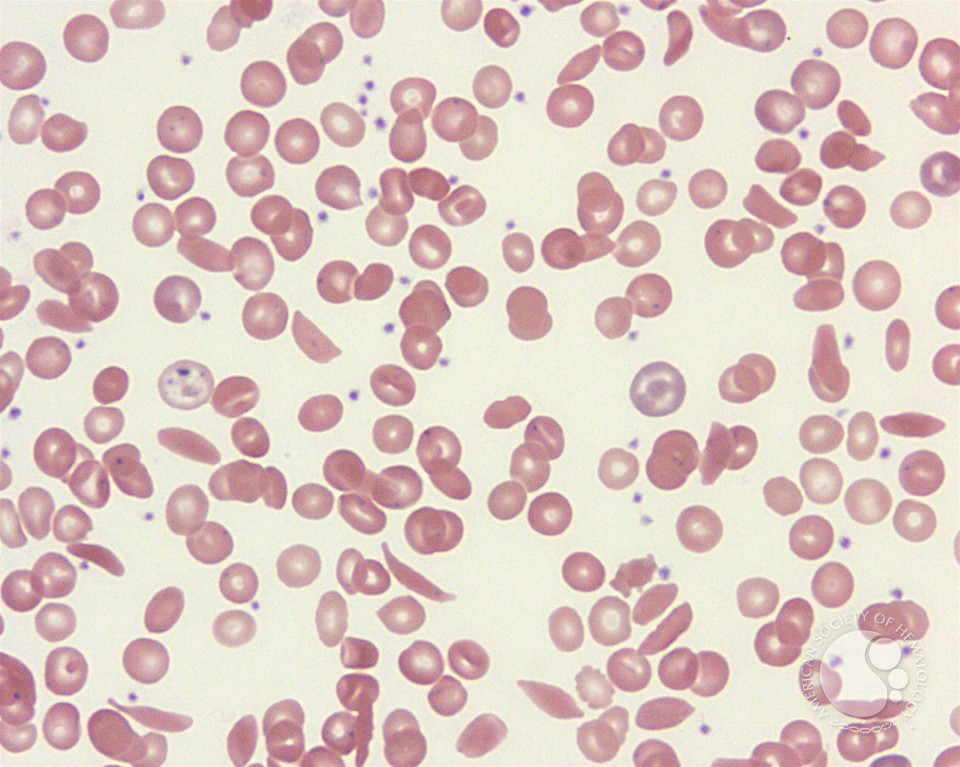
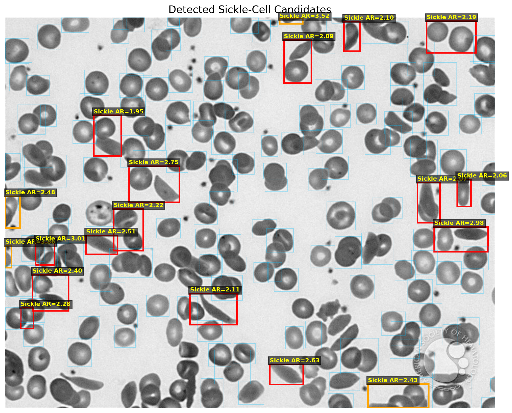

## Image comparison

Original blood smear

This image is the raw microscope view of the blood smear. Most erythrocytes appear round or slightly oval, while a smaller number show the elongated crescent-like shape associated with sickle cell disease.

Processed candidate detection image

As you can see, this obviously has room for improvement, and other identification features can be addded, especially if you want to track polychromatophilic RBCs, target cells, or Howell-Jolly bodies.
