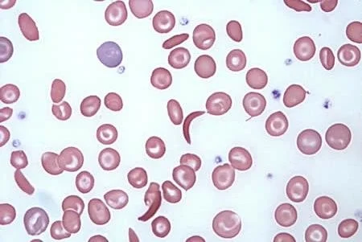

# Discussion M4: Image Processing for a Sickle Cell Blood Smear

## Original Image

## Brief Description

This image is a microscopy blood smear from a patient with sickle cell disease. It is important because the slide contains visible cell-shape abnormalities that are strongly connected to disease severity, vaso-occlusive risk, anemia, and overall hematologic status. In a biomedical engineering context, this kind of image is useful because it can be processed automatically to measure disease burden rather than relying only on manual visual review.

The ResearchGate figure is presented as a blood smear from a patient with sickle cell disease. My interpretation is that it was created using a standard thin blood smear workflow and then imaged by light microscopy, which is a routine way to visualize red blood cell morphology in hematology.

Source image: [ResearchGate figure, "Blood smear of a patient with Sickle Cell Disease"](https://www.researchgate.net/figure/Blood-smear-of-a-patient-with-Sickle-Cell-Disease_fig1_295088258).

## Three Features Worth Quantifying

### 1. Sickled Cell Fraction

One obvious feature is the number or fraction of elongated crescent-shaped red blood cells. A high sickled-cell fraction could indicate more severe deformation of the blood cells and a greater risk that they will obstruct microvessels. A useful image-processing approach would be to measure each detected cell's eccentricity, aspect ratio, curvature, and solidity.

### 2. Target Cells / Central Pallor Pattern

Some cells show a target-like appearance with a darker center and rim separated by a lighter ring. Quantifying how often this pattern occurs could give information about abnormal membrane structure and hemoglobin distribution. One way to measure this would be to compare pixel intensity in the center of each cell against the intensity in a surrounding ring.

### 3. Cell Size, Count, and Spatial Density

Even among non-sickled cells, the image contains useful information about the size distribution and packing density of red blood cells. Measuring cell area, equivalent diameter, and nearest-neighbor spacing could help estimate changes in smear quality, cell crowding, and heterogeneity in the sample. These metrics are also useful for separating individual cells from debris or overlapping cells.

## How I Would Process This Image

I would start by converting the RGB image into a color space that separates color from brightness, such as LAB or HSV, because the pink cells stand out from the pale background more clearly there than in grayscale alone. After that, I would threshold the image to isolate candidate red blood cells, remove small specks with morphological cleanup, and label each connected object as an individual cell.

Once the cells are segmented, I would compute shape features such as area, perimeter, eccentricity, major-axis length, minor-axis length, and solidity. These features would help identify likely sickled cells. I would also compute a radial intensity profile for each cell so the center can be compared to the surrounding ring, which is a simple way to flag target-like cells. Finally, I would summarize the image with counts, histograms, and an overlay that highlights likely abnormal cells for manual review.

## Notebook

The accompanying notebook is [discussion4.ipynb](/c:/Users/errin/ClassFiles/BIOM440/DiscussionM4/discussion4.ipynb). It now uses [discussion4_analysis.py](/c:/Users/errin/ClassFiles/BIOM440/DiscussionM4/discussion4_analysis.py) to automatically select the newest local image in the project, analyze it, and save an overlay image plus a feature table in `outputs/`.

## Important Limitation

This notebook is a simple educational demonstration, not a clinical diagnostic pipeline. The image contains overlapping cells and staining variation, so the automated labels should be treated as rough candidate detections rather than definitive classifications.
